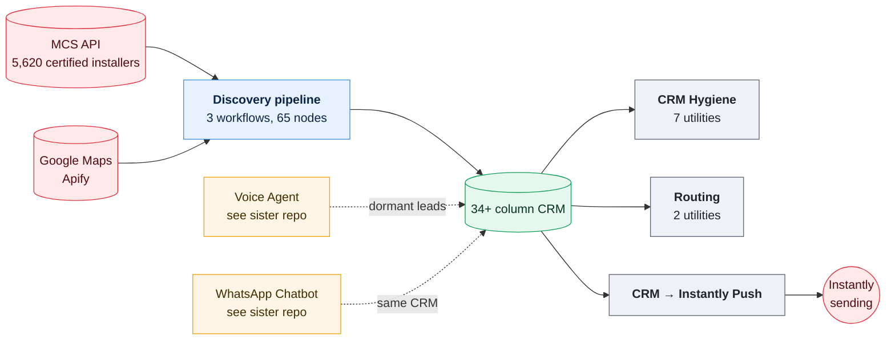

# CRM, Scraper & Outreach Engine

**13 n8n workflows, 113 nodes, ~2,600 lines of pipeline JavaScript, and roughly 5,300 lines of research, spec and copy behind them. A B2B lead-generation system for UK home-service installers, built, measured, broken and rebuilt across three named revisions between May and September 2026.**

This is the CRM and outreach half of a larger automation system. The voice-agent and WhatsApp-chatbot half, which reads and writes the same shared CRM, is documented separately: **[plutiolabs-n8n-portfolio](https://github.com/mghazwan06-star/plutiolabs-n8n-portfolio)**.



## What's in here

| | Workflows | Nodes | What it does |
|---|---:|---:|---|
| [**Discovery pipeline**](workflows/discovery/) | 3 | 65 | Dual-source scrape (MCS certified installers + Google Maps), enrich, score, competitor-match, route |
| [**CRM hygiene**](workflows/crm-hygiene/) | 7 | 30 | Audit, dedupe, integrity-check, contact-quality. Keeps a spreadsheet-backed CRM correct while four systems write to it |
| [**Routing**](workflows/routing/) | 2 | 10 | Recompute and audit template routing after a rule change, at zero re-enrichment cost |
| [**Outreach**](workflows/outreach/) | 1 | 8 | Direct CRM to Instantly API push, replacing manual CSV export |

Plus the research and process documentation that produced the pipeline's design decisions. This isn't an afterthought here, it's a first-class part of the build:

| Document | What it covers |
|---|---|
| [**Pipeline architecture**](pipeline/architecture.md) | The full ten-stage pipeline, why it's split parent/child, why two data sources |
| [**Dual-source design**](pipeline/dual-source-design.md) | Measured-before-built spec for adding a certified-installer API as a seed list |
| [**ICP scoring**](pipeline/icp-scoring.md) | The two-priority system and enrichment-API cost scoping |
| [**CRM schema**](pipeline/crm-schema.md) | Every column, who writes it, who reads it, and the write-pattern bug that took three fixes to actually close |
| [**Cold email playbook**](outreach/playbook.md) | Condensed from a 1,900+ line internal playbook of sourced outreach psychology and copy framework |
| [**Routing logic**](outreach/routing-logic.md) | How every lead's template and channel gets decided, in code, once, plus how all 5,603 leads actually segment |
| [**Cross-template fixes**](outreach/cross-template-fixes.md) | Eight structural copy defects found writing five templates, three of them only catchable by reading finished copy as a real recipient would |
| [**Template redesigns**](outreach/template-redesigns.md) | The actual before-and-after copy for all five templates, including one call-to-action that went through five versions before it was right |
| [**UK market research**](market-research/uk-installer-market.md) | Sourced, confidence-graded evidence behind the target market and ICP |
| [**Build log**](engineering/build-log.md) | Every logged bug across three pipeline revisions, root cause and fix |
| [**Launch readiness**](engineering/launch-readiness.md) | The four measurement gates a go-live has to clear |
| [**How Claude was used**](engineering/how-claude-was-used.md) | What a research-heavy build needed that a node-configuration build didn't |

## The part worth reading

The internal build log behind this pipeline ran past 1,000 lines across three named revisions before being condensed for publication. Two findings from it say more about how this was actually built than a feature list would.

### The bug found inside the pipeline's own output, not its code

A LinkedIn message generator contained hardcoded client-result figures: invented job counts, invented cities, invented timeframes, written as finished copy rather than an obvious placeholder. Not a syntax error. Not a validator warning. A fabricated claim sitting in a code path with a live execution date, found by asking the system that helped write it to review its own output adversarially.

```javascript
// What was sitting in the workflow, presented as a real result:
barJobs = '14'; barWeeks = '6'; barCity = 'Birmingham';
```

I removed it from the workflow entirely rather than patch it. The same figures, found separately in the email template copy, got logged as a hard launch blocker with three resolution paths, none of which was leave it and hope nobody checks. Full finding in [`engineering/build-log.md`](engineering/build-log.md). The framework document that survives it, stripped of the specific invented numbers, is [`outreach/playbook.md`](outreach/playbook.md).

### The API calls that reported success while doing nothing

Every external API call in the enrichment pipeline was written using a helper function that doesn't exist in this n8n version's Code node sandbox. Every call threw immediately, got silently caught by an error-handling setting configured to keep the workflow running regardless, and the pipeline reported success while doing none of the enrichment it claimed to. It survived multiple audit passes because a validator warning about exactly this pattern had been dismissed as a known false positive: another workflow does it this way too. That other workflow had also never been run with real credentials.

What finally caught it: a workflow claiming to have completed real external polling in 17 seconds hadn't. Genuine API polling cannot finish that fast. Duration, not status, was the tell. Six more findings of comparable severity sit in [`engineering/build-log.md`](engineering/build-log.md): a competitor-matching index that silently shrank under two unrelated bugs, a CRM write key that took three separate fixes to actually close, a review-text fetch that was never built despite the sort logic downstream of it being correctly designed.

## The research behind the targeting

This isn't only a scraping-and-sending system. A meaningful share of the build is sourced market research and a documented outreach-psychology framework, not just workflow code.

- **An internal market-research document that ran past 680 lines**, every figure confidence-graded A through D by source reliability, that reframed the entire targeting strategy. UK installers turned out to be demand-constrained in some verticals and labour-constrained in others, with the real bottleneck sitting in owner admin time rather than lead volume. That finding inverted an earlier assumption about which vertical to prioritise. Condensed version published in [`market-research/uk-installer-market.md`](market-research/uk-installer-market.md).
- **An internal cold-email playbook that ran past 1,900 lines**, compiled from published research (Lavender, Gong, Jason Bay's 85-million-email analysis) and tested against real sends through the sending platform's own test-send endpoint, not just drafted and shipped. Condensed version published in [`outreach/playbook.md`](outreach/playbook.md).
- **A ten-stage discovery pipeline**, measured against live source data before a single node was built: competitor-match yield at different distance and gap thresholds, contact-fill rates by data source, a region-filter bug caught purely by checking distribution rather than trusting a field name.

## Run it

Every workflow export in [`workflows/`](workflows/) has credentials stubbed as `CREDENTIAL_ID` and account identifiers as `YOUR_*` placeholders. Re-map them after import. Diagrams in [`assets/diagrams/`](assets/diagrams/) are generated from each workflow's real canvas coordinates, including the sticky-note documentation left on the canvas, the same way as the sister repository.

## Start here

- **Two minutes:** this page, then [`pipeline/architecture.md`](pipeline/architecture.md).
- **Ten minutes:** [`engineering/build-log.md`](engineering/build-log.md), where the engineering actually is.
- **The research:** [`market-research/uk-installer-market.md`](market-research/uk-installer-market.md) and [`outreach/playbook.md`](outreach/playbook.md).

## Why I built this

For the same UK home-service installers described in the sister repository: solar, HVAC, insulation, heating. 94.8% of this market runs under ten employees. No marketing department, no ops team, just an owner who's often on the tools himself. This half of the system exists to find and reach those businesses in the first place; the voice agent and chatbot exist to answer the leads once they respond. Same CRM, same client, two repositories, because they're genuinely different engineering problems. One is real-time conversation handling under a hard latency budget. This one is batch data pipelines and outreach sequencing.

I've left client names, pricing strategy and commercial scripts out of what's published here. The research citations and the engineering are the point. Credentials appear as `CREDENTIAL_ID`, account identifiers as `YOUR_*`.

**Stack:** n8n, Claude (Anthropic API), Apify, MCS certified-installer API, Google Maps, Instantly, ZeroBounce, Google Sheets.
