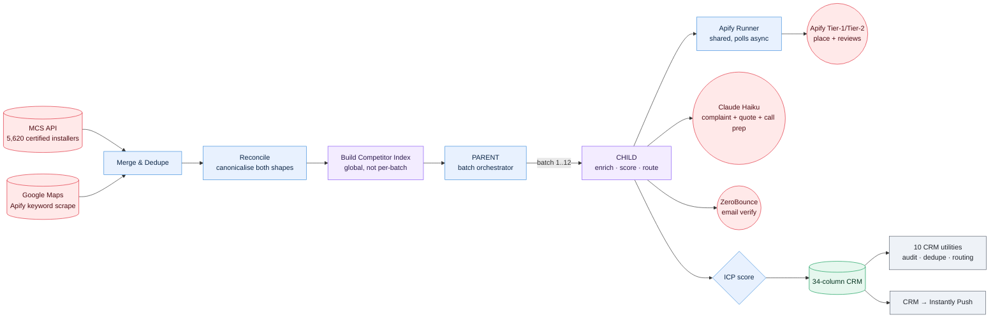

# Pipeline Architecture

**3 core workflows, 10 CRM utilities, 65 nodes, ~2,600 lines of ES5 JavaScript in the pipeline alone, closer to 4,500 once the utilities are counted.** Built, broken, measured and rebuilt across three named revisions (v2 to v3 to v4) between May and September 2026, with a written decision log at every step.

This finds, enriches, scores and routes UK trade businesses into a 34-column CRM, then hands qualified leads to the outreach layer described in [`outreach/`](../outreach/).

## Why two sources, not one

Google Maps keyword search was the whole pipeline through v2. It works, but it has a structural hole: roughly 20 to 30% of what it finds has no website. No website means no domain to hand to an enrichment API, which means no email. A cold-email system missing an email for a third of its leads is really a phone-only system wearing an email system's clothes.

MCS Certified, the UK's Microgeneration Certification Scheme, solves this without adding a second scraper. It's one HTTP GET returning a 4.2 MB JSON array of 5,620 UK certified solar, heat pump, battery and biomass installers, **100% with a working email address**. It costs nothing to call and needs no key.

The two sources do different jobs and were never run as parallel pipelines:

| Source | Job | Why only it can do this |
|---|---|---|
| **MCS API** | The **list**: who to target, where, verified email, certification | Google Maps cannot tell you who is MCS certified and cannot reliably give you an email |
| **Google Maps (Apify)** | The **ammunition**: review text, hours, categories, star rating | MCS carries none of that. Every complaint-driven and social-proof email template dies without it |

Run MCS alone and every lead routes to the generic fallback template, because there's no complaint data and no review quote to work with. Run Maps alone and the 20 to 30% no-email hole persists. The architecture settled on this: MCS is the seed list, Google Maps is the enrichment layer, run once, written once. Full measured rationale in [`dual-source-design.md`](dual-source-design.md).

## The ten stages

| # | Stage | What it does | Runs for |
|---|---|---|---|
| 0 | Config | Every client-configurable value in one node. API keys as credentials, everything else as parameters |: |
| 1a | MCS Seed | One HTTP GET, split into 5,620 records, tagged `source: mcs` | All |
| 1b | Seed Filter | Technology and entity-type filter down to the run scope | All |
| 1c | Google Maps Discovery | Keyword search, narrowed to what MCS structurally cannot cover (boiler, gas, plumbing, see [`dual-source-design.md §14`](dual-source-design.md)) | All |
| 1d | Merge & Dedupe | Union both sources on normalised phone or website domain. Source-conflict precedence rules decide which side wins each field | All |
| 2 | Normalize | One canonical record shape regardless of origin | All |
| 3a | Apify Tier-1 Lookup | Place lookup per MCS lead: rating, reviews, hours, categories | MCS rows needing a Google match |
| 3b | Competitor Match | Geospatial join over a **global** index. Same-technology, within 10 miles, review gap banded 10 to 150 | All |
| 4 | ICP Score | Priority 1 (full pipeline) vs Priority 2 (enrichment-only) | All |
| 5 | Apify Tier-2 Reviews | Review text, lowest-rated and highest-rated pulled together | Priority 1 only |
| 6 | Review Analysis | Claude Haiku extracts `topComplaint` and `bestReviewQuote` | Priority 1 only |
| 7 | AI Personalize | Claude builds the Call Prep Card for the Day-2 phone call | Priority 1 only |
| 8 | Contact Enrich | Instantly Lead Finder, scoped to only call where it adds a real contact (see [`icp-scoring.md`](icp-scoring.md)) | Leads with a generic MCS email or no MCS email |
| 9 | Build CRM Row | Computes every routing decision (template route, email-2 route, trade/scene) and assembles the 34+ column row | All |
| 10 | Write to CRM | `appendOrUpdate` matched on a dedicated `Row Key` column | All |

Stages 6 and 7 were later merged into a single Claude call per lead. See [`engineering/build-log.md`](../engineering/build-log.md) for why, and what it saved.

## Why parent/child, not one workflow

The single-workflow version held every prospect in memory for the whole run. n8n retains every node's input and output for the life of an execution, so a chain of roughly twenty nodes over 5,603 items is about twenty copies of the dataset resident at once. The first full run didn't just fail. It saturated the entire n8n Cloud instance. Every endpoint started returning 503, not just the one workflow, including the health check.

The fix split orchestration from processing:

- **PARENT** fetches, filters, reconciles, builds one global competitor index, then loops batches through the child. It never holds enrichment data. The child returns **counts only**, deliberately, because returning records would put the dataset straight back into the parent's memory and undo the entire point.
- **CHILD** does the expensive per-batch work: Apify, Claude, ZeroBounce, the CRM write. Its memory releases the moment it returns.

Result: the same 5,603-lead dataset that killed the instance in one pass now completes in **1m52s across 12 batches of ~500**, each batch taking around 9.5 seconds.

The one thing this split makes fragile is anything that needs the whole dataset at once, like the competitor index. A 500-lead batch matching only against itself finds a usable competitor for 48.6% of eligible leads. The same leads matched against the full 5,603-record pool hit close to 100%. The index has to be built once, globally, before batching starts, then passed to every child call in a form compact enough not to defeat the memory split it exists to protect. Two entries in [`engineering/build-log.md`](../engineering/build-log.md), F-R2 and F-R16, cover two separate times this broke and how each was fixed.

## Why the child returns counts, not records

This is the single design decision that makes the parent/child split actually work rather than just relocating the memory problem one hop over. If the child handed records back to the parent, the parent would accumulate the full dataset across 12 batch calls, which is identical to the single-workflow failure with one extra step in between. Counts-only keeps the parent's memory footprint flat regardless of dataset size. The CRM write, the only place the full records actually need to exist, happens inside the child, once, then is released.

## Related

- [`dual-source-design.md`](dual-source-design.md): the MCS + Maps measurement work, competitor-matching math, and the review-sort fix
- [`icp-scoring.md`](icp-scoring.md): the two-priority system and the Instantly enrichment scoping rules
- [`crm-schema.md`](crm-schema.md): all 34+ columns, who writes them, who reads them
- [`../engineering/build-log.md`](../engineering/build-log.md): every bug this architecture produced and how each was found
